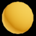

<!-- Improved compatibility of back to top link: See: https://github.com/othneildrew/Best-README-Template/pull/73 -->

<a name="readme-top"></a>

<!--
*** Thanks for checking out the Best-README-Template. If you have a suggestion
*** that would make this better, please fork the repo and create a pull request
*** or simply open an issue with the tag "enhancement".
*** Don't forget to give the project a star!
*** Thanks again! Now go create something AMAZING! :D
-->

<!-- PROJECT SHIELDS -->
<!--
*** I'm using markdown "reference style" links for readability.
*** Reference links are enclosed in brackets [ ] instead of parentheses ( ).
*** See the bottom of this document for the declaration of the reference variables
*** for contributors-url, forks-url, etc. This is an optional, concise syntax you may use.
*** https://www.markdownguide.org/basic-syntax/#reference-style-links
-->

[![Contributors][contributors-shield]][contributors-url]
[![Forks][forks-shield]][forks-url]
[![Stargazers][stars-shield]][stars-url]
[![Issues][issues-shield]][issues-url]
[![MIT License][license-shield]][license-url]
[![LinkedIn][linkedin-shield]][linkedin-url]

<!-- PROJECT LOGO -->
<br />
<div align="center">
  <a href="https://github.com/forestheims/synethsizer">
    
  </a>

<h3 align="center">Synethsizer</h3>

  <p align="center">
    A mesmerizing visual synthesizer.
    <br />
    <a href="https://github.com/forestheims/synethsizer"><strong>Explore the docs »</strong></a>
    <br />
    <br />
    <a href="https://github.com/forestheims/synethsizer">View Demo</a>
    ·
    <a href="https://github.com/forestheims/synethsizer/issues">Report Bug</a>
    ·
    <a href="https://github.com/forestheims/synethsizer/issues">Request Feature</a>
  </p>
</div>

<!-- TABLE OF CONTENTS -->
<details>
  <summary>Table of Contents</summary>
  <ol>
    <li>
      <a href="#about-the-project">About The Project</a>
      <ul>
        <li><a href="#built-with">Built With</a></li>
      </ul>
    </li>
    <li>
      <a href="#getting-started">Getting Started</a>
      <ul>
        <li><a href="#prerequisites">Prerequisites</a></li>
        <li><a href="#installation">Installation</a></li>
      </ul>
    </li>
    <li><a href="#usage">Usage</a></li>
    <li><a href="#roadmap">Roadmap</a></li>
    <li><a href="#contributing">Contributing</a></li>
    <li><a href="#license">License</a></li>
    <li><a href="#contact">Contact</a></li>
    <li><a href="#acknowledgments">Acknowledgments</a></li>
  </ol>
</details>

<!-- ABOUT THE PROJECT -->

## About The Project

[![Product Name Screen Shot][product-screenshot]](https://synethsizer.com)

Intent:

- Create something I enjoy, that I can share with others!
- Create this as a template repo for others to create and share 3D animations online!

This is a a refactoring / re-creation of a [previous project](https://github.com/forestheims/synethsizer-prev) I was working on in JavaScript, using reacts context hook for state management.

I decided to learn and utilize some of the "current and modern" web dev frameworks and libraries I had not explored yet, such as Next.js, Zustand, react-three-fibre, Tailwind, and TypeScript.

<p align="right">(<a href="#readme-top">back to top</a>)</p>

### Built With

- [![Next][Next.js]][Next-url]
- [![React][React.js]][React-url]
- [![Zustand][Zustand]][Zustand-url]
- [![Three][Three.js]][Three-url]
- [![Tailwind][Tailwind.js]][Tailwind-url]

<p align="right">(<a href="#readme-top">back to top</a>)</p>

<!-- GETTING STARTED -->

## Getting Started

Instructions on setting up your project locally.

To get a local copy up and running follow these simple example steps.

### Prerequisites

Things you need to use the software and how to install them.

- npm
  ```sh
  npm install npm@latest -g
  ```

### Installation

1. Clone the repo
   ```sh
   git clone https://github.com/forestheims/synethsizer.git
   ```
2. Install NPM packages
   ```sh
   npm install
   ```
3. Run on your computer
   ```sh
   npm run dev
   ```
4. Open on a local browser

   [http://localhost:3000](http://localhost:3000)

   <!-- 3. Enter your API in `config.js`
      ```js
      const API_KEY = 'ENTER YOUR API'
      ``` -->

<p align="right">(<a href="#readme-top">back to top</a>)</p>

<!-- USAGE EXAMPLES -->
<!--
## Usage

Use this space to show useful examples of how a project can be used. Additional screenshots, code examples and demos work well in this space. You may also link to more resources.

_For more examples, please refer to the [Documentation](https://example.com)_

<p align="right">(<a href="#readme-top">back to top</a>)</p> -->

<!-- ROADMAP -->

## Roadmap

- [x] Harmonic Oscillator re-created
- [x] Controls use Zustand for state management.
- [x] Rainbow color mode
- [ ] Audio responsiveness
  - [ ] Request access to client microphone
    - [Web Audio API](https://developer.mozilla.org/en-US/docs/Web/API/Web_Audio_API/Visualizations_with_Web_Audio_API)

See the [open issues](https://github.com/forestheims/synethsizer/issues) for a full list of proposed features (and known issues).

<p align="right">(<a href="#readme-top">back to top</a>)</p>

<!-- CONTRIBUTING -->

## Contributing

Contributions are what make the open source community such an amazing place to learn, inspire, and create. Any contributions you make are **greatly appreciated**.

If you have a suggestion that would make this better, please fork the repo and create a pull request. You can also simply open an issue with the tag "enhancement".
Don't forget to give the project a star! Thanks again!

1. Fork the Project
2. Create your Feature Branch (`git checkout -b feature/AmazingFeature`)
3. Commit your Changes (`git commit -m 'Add some AmazingFeature'`)
4. Push to the Branch (`git push origin feature/AmazingFeature`)
5. Open a Pull Request

<p align="right">(<a href="#readme-top">back to top</a>)</p>

<!-- LICENSE -->

## License

Distributed under the MIT License. See `LICENSE.txt` for more information.

<p align="right">(<a href="#readme-top">back to top</a>)</p>

<!-- CONTACT -->

## Contact

Forest Heims - forestheims@gmail.com

Project Link: [https://github.com/forestheims/synethsizer](https://github.com/forestheims/synethsizer)

<p align="right">(<a href="#readme-top">back to top</a>)</p>

<!-- ACKNOWLEDGMENTS -->

## Acknowledgments

- []()
- []()
- []()

<p align="right">(<a href="#readme-top">back to top</a>)</p>

<!-- MARKDOWN LINKS & IMAGES -->
<!-- https://www.markdownguide.org/basic-syntax/#reference-style-links -->

[contributors-shield]: https://img.shields.io/github/contributors/forestheims/synethsizer.svg?style=for-the-badge
[contributors-url]: https://github.com/forestheims/synethsizer/graphs/contributors
[forks-shield]: https://img.shields.io/github/forks/forestheims/synethsizer.svg?style=for-the-badge
[forks-url]: https://github.com/forestheims/synethsizer/network/members
[stars-shield]: https://img.shields.io/github/stars/forestheims/synethsizer.svg?style=for-the-badge
[stars-url]: https://github.com/forestheims/synethsizer/stargazers
[issues-shield]: https://img.shields.io/github/issues/forestheims/synethsizer.svg?style=for-the-badge
[issues-url]: https://github.com/forestheims/synethsizer/issues
[license-shield]: https://img.shields.io/github/license/forestheims/synethsizer.svg?style=for-the-badge
[license-url]: https://github.com/forestheims/synethsizer/blob/master/LICENSE.txt
[linkedin-shield]: https://img.shields.io/badge/-LinkedIn-black.svg?style=for-the-badge&logo=linkedin&colorB=555
[linkedin-url]: https://linkedin.com/in/forestheims
[product-screenshot]: public/img/synethsizer_front.PNG
[Next.js]: https://img.shields.io/badge/next.js-000000?style=for-the-badge&logo=nextdotjs&logoColor=white
[Next-url]: https://nextjs.org/
[React.js]: https://img.shields.io/badge/React-20232A?style=for-the-badge&logo=react&logoColor=61DAFB
[React-url]: https://reactjs.org/
[Zustand]: https://img.shields.io/badge/React-20232A?style=for-the-badge&logo=react&logoColor=61DAFB
[Zustand-url]: https://github.com/pmndrs/zustand
[Tailwind.js]: https://img.shields.io/badge/React-20232A?style=for-the-badge&logo=react&logoColor=61DAFB
[Tailwind-url]: https://tailwindcss.com/
[Three.js]: https://img.shields.io/badge/React-20232A?style=for-the-badge&logo=react&logoColor=61DAFB
[Three-url]: https://threejs.org/
